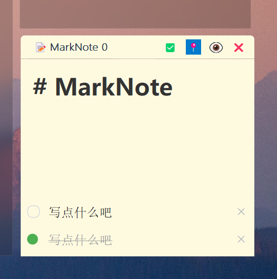
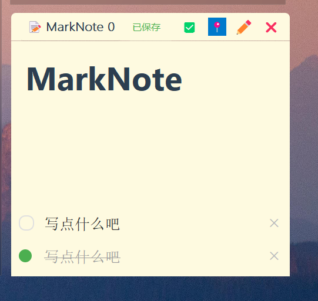
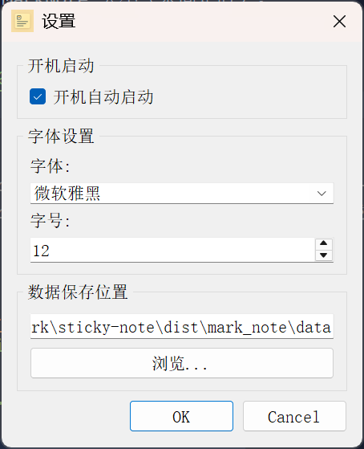

# MarkNote

一个简单易用的桌面便签应用程序，使用 Python 和 PyQt5 构建。

[](link-to-demo-video-or-gif) <!-- 你可以替换成演示视频或GIF链接 -->

## ✨ 功能特性

*   **创建与管理**: 轻松创建、编辑和删除多个 MarkNote。
*   **Markdown 支持**: 支持 Markdown 语法进行文本格式化，并提供实时预览模式。
*   **待办事项 (To-Do)**: 在 MarkNote 内添加和管理待办事项列表，带复选框。
*   **自定义外观**: 
    *   通过设置更改全局字体和字号。
    *   (未来可扩展：单独设置每个 MarkNote 的背景色)。
*   **固定 MarkNote**: 将便签固定在屏幕特定位置，防止意外移动。
*   **系统托盘**: 
    *   集成到系统托盘，方便快速访问。
    *   通过托盘菜单新建、显示/隐藏所有 MarkNote、打开设置或退出程序。
*   **自动保存**: 编辑内容后自动保存，防止数据丢失。
*   **数据路径自定义**: 在设置中选择数据文件的保存位置。
*   **开机启动**: 可选择设置程序在 Windows 启动时自动运行。
*   **自由拖动与缩放**: 轻松移动和调整 MarkNote 大小（未固定时）。

## 📸 截图 



<!-- 在这里添加你的应用截图 -->
<!-- 例如： -->
<!--  -->
<!--  -->

## 🚀 下载和使用 (推荐给普通用户)

1.  前往本项目的 [Releases 页面](https://github.com/xyooz/MarkNote/releases)。
2.  下载最新版本的 `MarkNote-vX.Y.Z.zip` (或类似命名的文件)。
3.  解压下载的 ZIP 文件。
4.  双击运行解压后文件夹中的 `MarkNote.exe` 文件即可开始使用。

---

## 🛠️ 从源代码运行 (开发者/贡献者)

如果你想从源代码运行或进行开发，请遵循以下步骤：

**环境要求:**
*   Python 3.x
*   Windows 操作系统 (因为使用了 `winreg` 和 `pywin32`)

**步骤:**
1.  **克隆仓库:**
    ```bash
    git clone https://github.com/xyooz/marknote.git 
    cd marknote
    ```

2.  **安装依赖:**
    ```bash
    pip install -r requirements.txt
    ```

3.  **运行程序:**
    ```bash
    python mark_note.py
    ```

## 📦 构建可执行文件 (EXE)

项目包含一个 `build.py` 脚本，用于使用 PyInstaller 将应用程序打包成单个 `.exe` 文件。

1.  **确保 PyInstaller 已安装:** 如果 `requirements.txt` 中没有，请先安装：
    ```bash
    pip install pyinstaller pyinstaller-hooks-contrib
    ```

2.  **运行构建脚本:**
    ```bash
    python build.py
    ```

3.  打包完成后，可以在 `dist` 文件夹中找到 `MarkNote.exe` 文件以及 `data` 文件夹。

**注意:**

*   确保 `mark_note_icon.ico` 图标文件位于项目根目录。
*   打包过程可能需要一些时间。
*   首次运行打包后的 `.exe` 文件时，它会在同级目录下自动创建 `data` 文件夹用于存储 MarkNote 数据。

## 💡 使用说明

*   **新建 MarkNote**: 右键点击系统托盘图标，选择"新建 MarkNote"。
*   **编辑内容**: 直接在 MarkNote 的编辑区域输入文字，支持 Markdown 格式。
*   **顶部按钮**: 
    *   `✅`: 添加一个新的待办事项。
    *   `📌`/`📍`: 固定/取消固定 MarkNote 位置。
    *   `👁️`/`✏️`: 切换 Markdown 预览/编辑模式 (快捷键 `Ctrl+E`)。
    *   `❌`: 关闭当前 MarkNote。
*   **保存**: 程序会自动保存，也可按 `Ctrl+S` 手动保存。
*   **待办事项**: 点击复选框标记完成/未完成，点击右侧 `×` 删除。
*   **系统托盘**: 
    *   左键单击：显示/隐藏所有 MarkNote。
    *   右键单击：打开菜单。
*   **设置**: 通过托盘菜单打开设置对话框，可以配置字体、开机启动和数据保存路径。

## ⚙️ 配置

在设置对话框中，你可以配置以下选项：

*   **开机启动**: 设置是否在 Windows 启动时自动运行程序。
*   **字体设置**: 选择应用程序默认使用的字体和字号。
*   **数据保存位置**: 指定 MarkNote 数据文件（`.ini` 文件）的存储目录。

## 🤝 贡献 

欢迎提交 Pull Requests 或 Issues 来改进此项目。

## 📄 许可证 

本项目采用 [MIT 许可证](LICENSE)。 <!-- 如果你有许可证文件 --> 